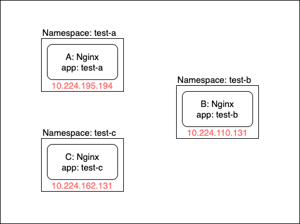
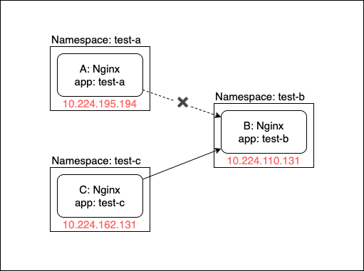

## はじめに

KubernetesのNetwork Policyについては以前から興味があったのですが、なかなか触る機会がなかったので、今回触ってみました。<br>
Kubernetesを勉強するにあたってGKEやEKSの選択肢はあったのですが、手元でコストをかけず触ってみるということでkindを選択しました。

### 使用ツール
今回の記事で使用するツールは以下になります。

* kind
* kubectl

## kind Cluster 構築

Network Policyを試してみるための環境を構築します。
今回は、[kind](https://kind.sigs.k8s.io/)を使用してKubernetes Clusterを構築します。
kindは簡単にKubernetes Clusterを構築できますが、今回はNetwork Policyを使用するため、Network Policyに対応しているネットワークプラグイン(CNIプラグイン)を使用しなければなりません。そのため、kindデフォルトのCNI(kindnetd)を無効化すること、また、Node数を増やす設定を入れた設定ファイルを適用してKubernetes Clusterを構築します。

```sh
$ cat kind-config.yaml
kind: Cluster
apiVersion: kind.sigs.k8s.io/v1alpha3
networking:
  disableDefaultCNI: true
nodes:
  - role: control-plane
  - role: worker
  - role: worker
  - role: worker

$ kind create cluster --config kind-config.yaml
```

構築が完了し、KUBECONFIGを設定した後、Kubernetes Cluster内のPodの状態を確認してみます。
CNIを無効にしているため、CoreDNSがPendingになっていることが分かると思います。

```
$ kubectl get pods --all-namespaces
NAMESPACE     NAME                                         READY   STATUS    RESTARTS   AGE
kube-system   coredns-5c98db65d4-9zb27                     0/1     Pending   0          8m42s
kube-system   coredns-5c98db65d4-lp89j                     0/1     Pending   0          8m42s
kube-system   etcd-kind-control-plane                      1/1
Running   0          7m52s
kube-system   kube-apiserver-kind-control-plane            1/1     Running   0          8m2s
kube-system   kube-controller-manager-kind-control-plane   1/1     Running   0          7m57s
kube-system   kube-proxy-8pjd4                             1/1     Running   0          8m25s
kube-system   kube-proxy-ggjcr                             1/1     Running   0          8m42s
kube-system   kube-proxy-qt2jz                             1/1     Running   0          8m25s
kube-system   kube-proxy-x7w9l                             1/1     Running   0          8m25s
kube-system   kube-scheduler-kind-control-plane            1/1     Running   0          7m43s
```

次に、このKubernetes Clusterに割り当てられたCIDR範囲を確認します。

```
$ kubectl cluster-info dump | grep -- --cluster-cidr
                            "--cluster-cidr=10.244.0.0/16",
```

次に、[Calico](https://www.projectcalico.org/)をKubernetes Clisterに適用していきます。
CalicoはNetwork Policyに対応しているネットワークプラグインです。
CIDR範囲をKubernetes Clusterに割り当てられたものと合わせるため、calico.yamlの`CALICO_IPV4POOL_CIDRO`を変更します。

```
$ curl -s https://docs.projectcalico.org/v3.11/manifests/calico.yaml | sed 's,192.168.0.0/16,10.244.0.0/16,' > calico.yaml
```

CalicoをKubernetes Clusterに適用します。

```
$ kubectl apply -f calico.yaml
configmap/calico-config created
customresourcedefinition.apiextensions.k8s.io/felixconfigurations.crd.projectcalico.org created
customresourcedefinition.apiextensions.k8s.io/ipamblocks.crd.projectcalico.org created
customresourcedefinition.apiextensions.k8s.io/blockaffinities.crd.projectcalico.org created
customresourcedefinition.apiextensions.k8s.io/ipamhandles.crd.projectcalico.org created
customresourcedefinition.apiextensions.k8s.io/ipamconfigs.crd.projectcalico.org created
customresourcedefinition.apiextensions.k8s.io/bgppeers.crd.projectcalico.org created
customresourcedefinition.apiextensions.k8s.io/bgpconfigurations.crd.projectcalico.org created
customresourcedefinition.apiextensions.k8s.io/ippools.crd.projectcalico.org created
customresourcedefinition.apiextensions.k8s.io/hostendpoints.crd.projectcalico.org created
customresourcedefinition.apiextensions.k8s.io/clusterinformations.crd.projectcalico.org created
customresourcedefinition.apiextensions.k8s.io/globalnetworkpolicies.crd.projectcalico.org created
customresourcedefinition.apiextensions.k8s.io/globalnetworksets.crd.projectcalico.org created
customresourcedefinition.apiextensions.k8s.io/networkpolicies.crd.projectcalico.org created
customresourcedefinition.apiextensions.k8s.io/networksets.crd.projectcalico.org created
clusterrole.rbac.authorization.k8s.io/calico-kube-controllers created
clusterrolebinding.rbac.authorization.k8s.io/calico-kube-controllers created
clusterrole.rbac.authorization.k8s.io/calico-node created
clusterrolebinding.rbac.authorization.k8s.io/calico-node created
daemonset.apps/calico-node created
serviceaccount/calico-node created
deployment.apps/calico-kube-controllers created
serviceaccount/calico-kube-controllers created
```

Calicoを適用した後、Kubernetes Cluster内のPodの状態を再度確認してみます。
CNIが有効化されたため、CalicoのPodとCoreDNSのPodがRunningになっていることが確認できると思います。

```
$ kubectl get pods --all-namespaces
NAMESPACE     NAME                                         READY   STATUS    RESTARTS   AGE
kube-system   calico-kube-controllers-758d7b8fd-trwb5      1/1     Running   0          14m
kube-system   calico-node-bf6qg                            0/1     Running   4          14m
kube-system   calico-node-cs5cz                            0/1     Running   5          14m
kube-system   calico-node-twkkl                            0/1     Running   4          14m
kube-system   calico-node-zpgz2                            0/1     Running   6          14m
kube-system   coredns-5c98db65d4-9zb27                     1/1     Running   0          55m
kube-system   coredns-5c98db65d4-lp89j                     1/1     Running   0          55m
kube-system   etcd-kind-control-plane                      1/1     Running   0          54m
kube-system   kube-apiserver-kind-control-plane            1/1     Running   0          54m
kube-system   kube-controller-manager-kind-control-plane   1/1     Running   0          54m
kube-system   kube-proxy-8pjd4                             1/1     Running   0          54m
kube-system   kube-proxy-ggjcr                             1/1     Running   0          55m
kube-system   kube-proxy-qt2jz                             1/1     Running   0          54m
kube-system   kube-proxy-x7w9l                             1/1     Running   0          54m
kube-system   kube-scheduler-kind-control-plane            1/1     Running   0          54m
```

しかし、calico-nodeというDaemonSetが再起動を繰り返し、Readyになっていません。<br>
同じ問題を抱えている[issue:installing calico requires a change to net.ipv4.conf.all.rp_filter](https://github.com/kubernetes-sigs/kind/issues/891)があったので、issue内に記載がある通りcalico-nodeのPodの`FELIX_IGNORELOOSERPF`という環境変数をtrueに変更します。

```
$ kubectl -n kube-system set env daemonset/calico-node FELIX_IGNORELOOSERPF=true

daemonset.extensions/calico-node env updated
```

caloco-nodeが更新、再作成され、Readyになっていることを確認できました。

```
$ kubectl get pods --all-namespaces
NAMESPACE     NAME                                         READY   STATUS    RESTARTS   AGE
kube-system   calico-kube-controllers-758d7b8fd-trwb5      1/1     Running   0          54m
kube-system   calico-node-bf6qg                            1/1     Running   0          2m46s
kube-system   calico-node-cs5cz                            1/1     Running   0          2m46s
kube-system   calico-node-twkkl                            1/1     Running   0          2m46s
kube-system   calico-node-zpgz2                            1/1     Running   0          2m45s
kube-system   coredns-5c98db65d4-9zb27                     1/1     Running   0          95m
kube-system   coredns-5c98db65d4-lp89j                     1/1     Running   0          95m
kube-system   etcd-kind-control-plane                      1/1     Running   0          95m
kube-system   kube-apiserver-kind-control-plane            1/1     Running   0          95m
kube-system   kube-controller-manager-kind-control-plane   1/1     Running   0          95m
kube-system   kube-proxy-8pjd4                             1/1     Running   0          95m
kube-system   kube-proxy-ggjcr                             1/1     Running   0          95m
kube-system   kube-proxy-qt2jz                             1/1     Running   0          95m
kube-system   kube-proxy-x7w9l                             1/1     Running   0          95m
kube-system   kube-scheduler-kind-control-plane            1/1     Running   0          94m
```

## Network Policy の作成

今回はNetwork Policyのフィールドの簡単な説明と簡単なテストを実施していきます。
詳しくは、公式のページをご確認ください。
* [Network Policies](https://kubernetes.io/docs/concepts/services-networking/network-policies/)
* [Declare Network Policy](https://kubernetes.io/docs/tasks/administer-cluster/declare-network-policy/)

まず、Network PolicyのManifest例を記載します。

```
$ cat network-policy.yaml
apiVersion: networking.k8s.io/v1
kind: NetworkPolicy
metadata:
  name: network-policy
  namespace: default
spec:
  podSelector:
    matchLabels:
      app: test1
  policyTypes:
  - Ingress
  - Egress
  ingress:
  - from:
    - ipBlock:
        cidr: 172.17.0.0/16
        except:
        - 172.17.1.0/24
    - namespaceSelector:
        matchLabels:
          project: test
    - podSelector:
        matchLabels:
          app: test2
    ports:
    - protocol: TCP
      port: 6379
  egress:
  - to:
    - ipBlock:
        cidr: 10.0.0.0/24
    ports:
    - protocol: TCP
      port: 5978
```

Network Policyを有効化するためにアクセス制御したい対象のPodと同じNamespaceにNetworkPolicyリソースを作成し、アクセス制御ルールを定義します。アクセス制御したい対象のPodは`spec.podSelector.matchLabels`にて、対象のPodをラベルセレクトします。<br>
`spec.policyTypes`では、このNetworkPolicyリソースで扱うルールを選択します。ルールには、Ingress(インバウンドのトラフィック)とEgress(アウトバウンドのトラフィック)に関するルールが定義できます。<br>
Ingress、Egressそれぞれのルールの定義については、`spec.ingress`、`spec.egress`に設定します。Ingress、Egress共にfrom、toの違いはありますが、設定方法は同じです。from/toにて対象を指定し、portsにて対象のportとプロトコルを指定します。<br>
from/toで使用される対象の指定方法には以下３つがあります。

| policy type | target |
|:-|:-|
| podSelector | 特定のPodが対象 |
| namespaceSelector | 特定のNamespaceが対象 |
| ipBlock | 特定のCIDRが対象 |

最後に、簡単な例として全てのIngress/Egressルールを許可するManifestと遮断するManifestを記載します。

* 全てのIngress/Egressルールを許可

  ```
  $ cat network-policy.yaml
  apiVersion: networking.k8s.io/v1
  kind: NetworkPolicy
  metadata:
    name: network-policy
  spec:
    podSelector: {}
    policyTypes:
    - Ingress
    - Egress
    ingress:
    - {}
    egress:
    - {}
  ```

* 全てのIngress/Egressルールを遮断

  ```
  $ cat network-policy.yaml
  apiVersion: networking.k8s.io/v1
  kind: NetworkPolicy
  metadata:
    name: network-policy
  spec:
    podSelector: {}
    policyTypes:
    - Ingress
    - Egress
  ```

---

Network Policyについて簡単なテストを行っていきます。<br>
Namespaceが違うA, B, Cというアプリがある状態で、Bに対してNetwork Policyを適用し、A => Bへの接続を拒否し、C => Bへの接続を許可するということをやってみたいと思います。また、podSelector、namespaceSelectorを使用してみたいので、Cが属するNamespaceには、Namespace自体にもlabelを付与します。<br>

以下Manifestを適用して、`test-a`、`test-b`、`test-c`というNamespaceを作成し、それぞれ`test-pod-a`、`test-pod-b`、`test-pod-c`というPodを起動します。また、labelについても`app: test-a`、`app: test-b`、`app: test-c`と設定します。

```
$ cat test-pods.yaml
apiVersion: v1
kind: Namespace
metadata:
  name: test-a

---
apiVersion: v1
kind: Namespace
metadata:
  name: test-b

---
apiVersion: v1
kind: Namespace
metadata:
  name: test-c
  labels:
    ns: test-c

---
apiVersion: v1
kind: Pod
metadata:
  name: test-pod-a
  namespace: test-a
  labels:
    app: test-a
spec:
  containers:
    - name: nginx
      image: nginx:1.12-alpine

---
apiVersion: v1
kind: Pod
metadata:
  name: test-pod-b
  namespace: test-b
  labels:
    app: test-b
spec:
  containers:
    - name: nginx
      image: nginx:1.12-alpine

---
apiVersion: v1
kind: Pod
metadata:
  name: test-pod-c
  namespace: test-c
  labels:
    app: test-c
spec:
  containers:
    - name: nginx
      image: nginx:1.12-alpine
```

次に、作成されたA、B、CのPodのIPアドレスを確認します。

```
$ kubectl get pods -o wide -n test-a
NAME         READY   STATUS    RESTARTS   AGE     IP               NODE           NOMINATED NODE   READINESS GATES
test-pod-a   1/1     Running   0          4m18s   10.244.195.194   kind-worker3   <none>           <none>

$ kubectl get pods -o wide -n test-b
NAME         READY   STATUS    RESTARTS   AGE   IP               NODE           NOMINATED NODE   READINESS GATES
test-pod-b   1/1     Running   0          17m   10.244.110.131   kind-worker2   <none>           <none>

$ kubectl get pods -o wide -n test-c
NAME         READY   STATUS    RESTARTS   AGE     IP               NODE          NOMINATED NODE   READINESS GATES
test-pod-c   1/1     Running   0          4m23s   10.244.162.131   kind-worker   <none>           <none>
```

ここまでで以下のような状態になります。<br>



次に、以下のNetworkPolicyを適用します。

```
$ cat network-policy.yaml
apiVersion: networking.k8s.io/v1
kind: NetworkPolicy
metadata:
  name: network-policy
  namespace: test-b
spec:
  podSelector:
    matchLabels:
      app: test-b
  policyTypes:
  - Ingress
  ingress:
  - from:
    - namespaceSelector:
        matchLabels:
          ns: test-c
    ports:
    - protocol: TCP
      port: 80
```

この状態でA => B、C => B、A => Cへの接続を試してみます。

```
# A => B
$ kubectl -n test-a exec -it test-pod-a -- wget -T 3 10.244.110.131
Connecting to 10.244.110.131 (10.244.110.131:80)
wget: download timed out
command terminated with exit code 1

# C => B
$ kubectl -n test-c exec -it test-pod-c -- wget -T 3 10.244.110.131
Connecting to 10.244.110.131 (10.244.110.131:80)
index.html           100% |**************************************************|   612   0:00:00 ETA

# A => C
kubectl -n test-a exec -it test-pod-a -- wget -T 3 10.244.162.131
Connecting to 10.244.162.131 (10.244.162.131:80)
index.html           100% |*******************************|   612   0:00:00 ETA
```

A -> Bだと接続できずタイムアウトになり、C => Bだと接続できていることが分かります。また、A => C は特に制御していないため、接続できていることがわかります。<br>
以下の状態になっていることが確認できました。



## まとめ
KubernetesのNetwork Policyについて調べて使ってみました。以前から試そうと思っていたのですが、実際に触ってみるとCalicoのことなど知らなかったことも知ることができてとても良かったです。次はPod Security Policyや、Open Policy Agentなどに挑戦してみたいです。<br>
最後に、今回紹介した設定ファイルなどをリポジトリにまとめましたので、ファイルとして参照したい方は以下のリポジトリを利用してみてください。
* [Kubernetes NetworkPolicy Test](https://github.com/grimoh/kubernetes-network-policy-test)

