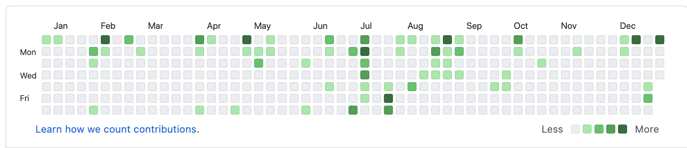

今年について振り返ってみる。

### OSS活動

今年のGitHub Activityは以下。

主にasdf-vm pluginとブログ関連のアクティビティだけど年々活発になってきているので良い。
来年はさらに活発に活動できれば良いな。

asdf-pluginの中でも、asdf-starship、asdf-k6は他者からissueやPRをもらう機会があり、すごく勉強になった。

### SRE NEXT

スポンサーとしてブースを出していた。後から聞いた話だけど、SRE NEXTについて私がRTしてたのがきっかけでスポンサー応募の話が出たらしくて感謝。弊社SREでどうしていくか、今後自分がどこを推進していくか、セッション聞きながら整理でき、今年一年の目標「社外イベントで登壇」を心に決めた日。SREを社外の人と話す機会がこれまでなかったので、社外の人と話すことができてすごい幸せだった。SRE Loungeも行きたいと思ったが、コロナ禍に入ってしまった....。

### Infra Study Meetup

人生で初めての外部登壇。今年の目標を達成した。LTで5分だけれど。
「Production Ready」のことを話したので、タイムラインもほぼコメントもらえなかったので、あまりフィードバックなかったのが悲しみ....。次回からもっとわかりやすく伝えられたら良いなと思う。
LTしたときの資料は以下。
* https://speakerdeck.com/grimoh/production-ready-with-dev-process-improvement

### 英語

昨年に引き続き、4月ごろまで仕事で英語を使ってやりとりをする機会があったので、モチベーションを保てていたけれど、仕事で使わなくなってから英語を使う機会が少なくなってしまった。意識して英語でインプットはしているけれど。

### ボードゲーム

ボードゲームといっても「麻雀」と「チェス」。12月ごろから無性にやりたくなった。

「麻雀」に関してはn回目の学び直し。役を覚えた気になってオンラインでやってただけなので、役をしっかり覚えて意識して役を作るレベルにはなりたいと思って本を買って勉強中。

「チェス」はやったことなかったので、本当に基本から本を買って勉強中。

### その他

会社近くから電車で30分くらいのところに引っ越した。1Kから1LDKに引っ越して在宅勤務の環境が良くなったのは良かった。部屋が広くなったので、だいぶお金を使ってしまったけど。

---

来年については１月に書きます。
