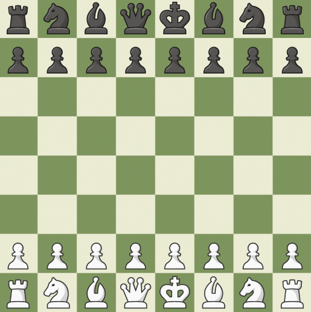
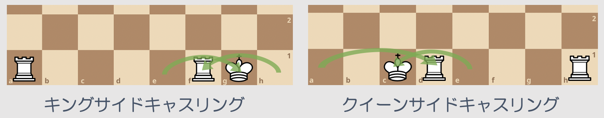
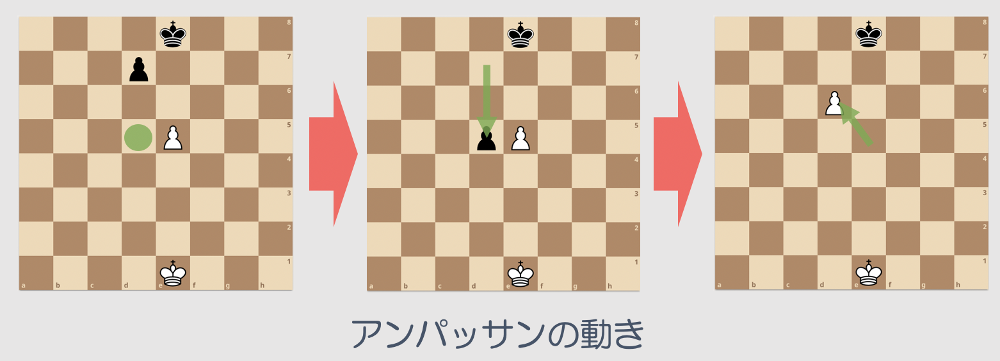
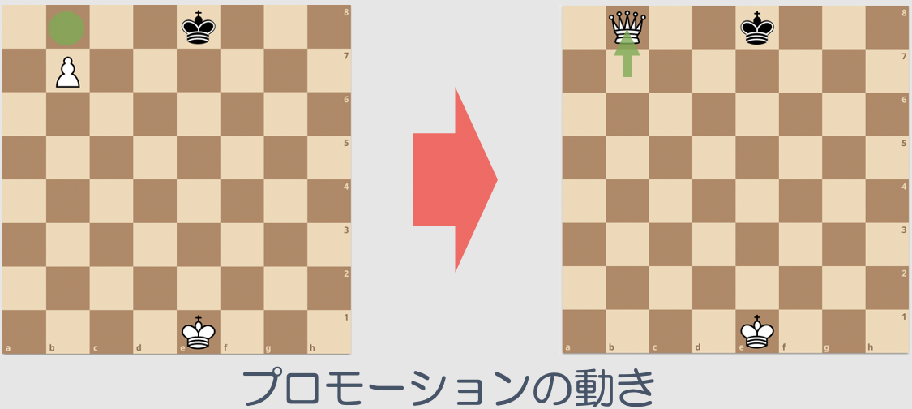

昨年(2020年)の12月からチェスを始めたので、簡単なルールを備忘録代わりに記載していく。

## チェスって何?

チェスとはどんなゲームなのかというと「2人用のボードゲーム/マインドスポーツ」。8x8のボードで6種類(16個)の駒を用いて行い、駒は以下の6種類がある。
* ポーン、ナイト、ビショップ、ルーク、クイーン、キング

将棋と同じ、古代インド「チャトランガ」というゲームをルーツに持つゲームとされていて、プレイヤー人口が世界的にとても多いゲームである。

## 基本ルール

基本的なルールについて説明していく。 
プレイヤーは白と黒に分かれ、白が必ず先手となる。交互に1手ずつ動かしていき、パスはできない。駒が移動するところに相手の駒があれば駒を取れるが、将棋と違って、基本的に取った駒は使えない。ナイト以外の駒は他の駒を飛び越えて移動できない、これは将棋の「桂馬」と同じように見える。自分の駒の攻撃範囲に敵のキングがある状態を`チェック`といい、これを回避できない状態を`チェックメイト`という。

### 勝敗

次に、勝敗について説明していく。
基本的には以下の4つのパターンで勝敗が決まる。
* チェックメイト or 時間切れ or 投了(`リザイン`) or 引き分け

引き分けについては、以下の条件のどれかに合致した場合に引き分けとなる。
* キングがチェックされない場所へ移動できなくなった場合(`ステルスメイト`)
* 互いにチェックメイトできなくなった場合
* 一方のプレイヤーの引き分けの提案を受けれた場合
* 以下の場合は、一方のプレイヤーの申し出により引き分けとなる
  * 50手連続して双方のポーンが動かず、互いに駒を取らない場合
  * 手番と駒配置が同じ局面が3度生じた場合(`スリーフォールドレピティション`)

### 駒の動き方

次に、各駒の動き方と特殊な駒の動きについて説明していく。

#### ポーン

* 将棋でいう「歩兵」
* 正面1マス移動できる
* 初めて動く時のみ正面2マス移動できる
* 斜め前方に敵の駒があれば敵の駒を取ることができる

#### ナイト

* 将棋でいう「桂馬」
* 全方向の桂馬(将棋の変則ルールでいう「八方桂」)
* 最大8箇所のうち任意のマスに移動できる

#### ビショップ

* 将棋でいう「角行」
* 斜め方向の任意のマスに移動できる

#### ルーク

* 将棋でいう「飛車」
* 縦/横方向の任意のマスに移動できる

#### クイーン

* 将棋でいう「飛車」+ 「角行」
* 全て方向の任意のマスに移動できる

#### キング

* 将棋でいう「王将」
* 全て方向の任意の1マスに移動できる

### 特殊な動き方

#### キャスリング(キングの入城)

* 1手でキングとルークを同時に動かすことができるルール
* 以下の手順を満たした時に実行可能
  * キングと(キャスリングする)ルークが1度も動いていないこと
  * キングと(キャスリングする)ルークの間に駒が置かれていないこと
  * キングがチェックされていないこと
  * キングが跨ぐマスと移動先のマスが攻撃されていないこと
* キング側(右側)のキャスリングを`キングサイドキャスリング`という
* クイーン側(左側)のキャスリングを`クイーンサイドキャスリング`という

#### アンパッサン(通過捕獲)

* 敵のポーンが2マス移動してきた場合、その直後の手番でそのポーンを自分のポーンで取り、斜め前方に移動できるルール

#### プロモーション(昇格)

* 将棋でいう「成る」
* ポーンが盤の端に到達したときにそのポーンをポーン以外の任意の駒に取り替えなくてはいけないルール
  * 取り換える駒はナイト、ビショップ、ルーク、クイーン

## どう戦う?

これらの基本的なルールを知った上でゲームをどう戦うのかというところで、まず、ゲームの流れとしては以下のような区分がある。
* オープニング(~20手)
* ミドルゲーム(20手~40手)
* エンドゲーム(40手~)

オープニングでは、基本的に以下のようなことを考えて、駒を進めていく。チェスは歴史が長く、よく研究されたゲームであるため、`定跡`という形で以下を踏まえた答えがある。これを覚えることがチェスの勉強におけるネクストステップになるだろう。

1. 攻撃範囲拡大
   * 強力な駒の通り道を作ること
1. 中央支配
   * 駒を中央へ集中させること
1. 防御とルークの展開
   * 早くキャスリングすること

### 強力な駒

「1.攻撃範囲拡大 - 強力な駒の通り道を作ること」に関して`強力な駒`とは何か説明していく。駒には価値が決められており、これを考えながら駒を進めていく。キングについては取られることはなく、チェックメイトされれば「負け」であるが、キングも含めて点数が以下のように決められている。点数はポーンを1としたときの各駒の価値。

| 駒 | 強さ(点数) |
|:-|:-|
| キング | 4 |
| クイーン | 9 |
| ルーク | 5 |
| ビショップ | 3 |
| ナイト | 3 |
| ポーン | 1 |

価値という考え方以外で強力な駒として、チェックメイトを行うにあたって必要な駒というものがある。チェックメイトに必要な駒の組み合わせは以下。
* クイーン
* ルーク
* ビショップ x2
* ビショップ + ナイト
* プロモーションできるポーン

## 最後に

今後もチェスについて勉強していき、チェスについてのブログも書いていきたいと思う。
