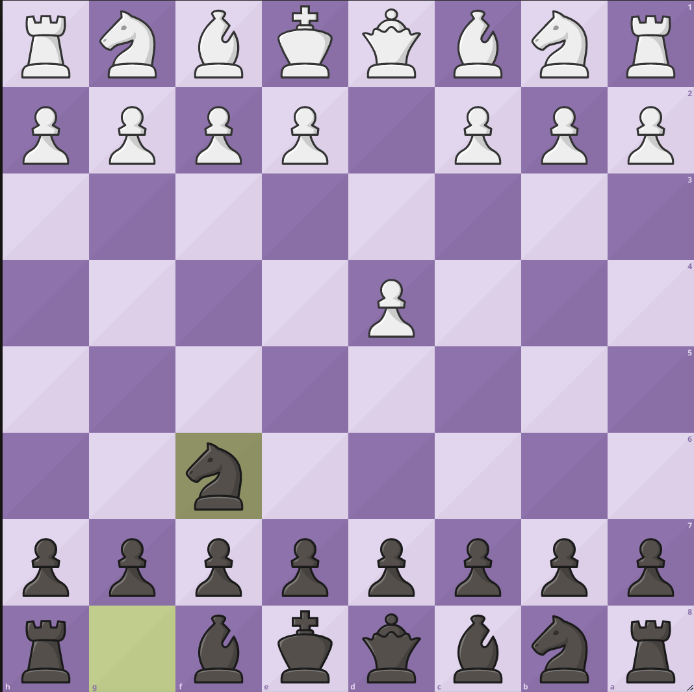
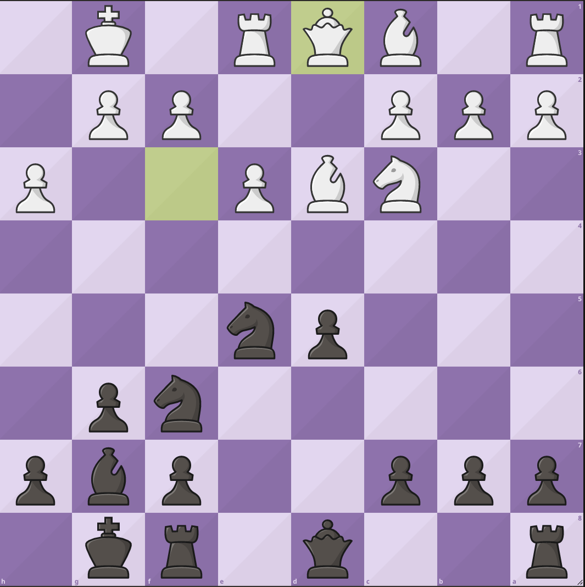
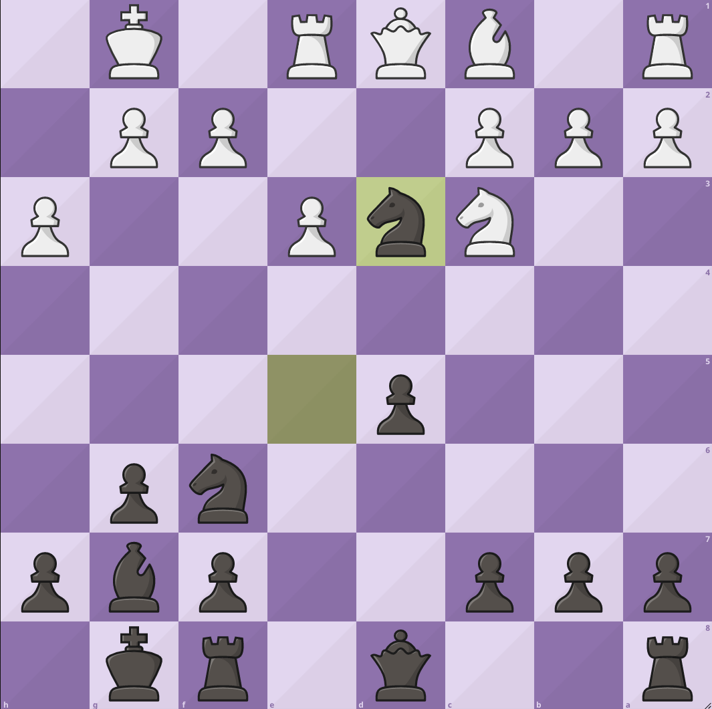
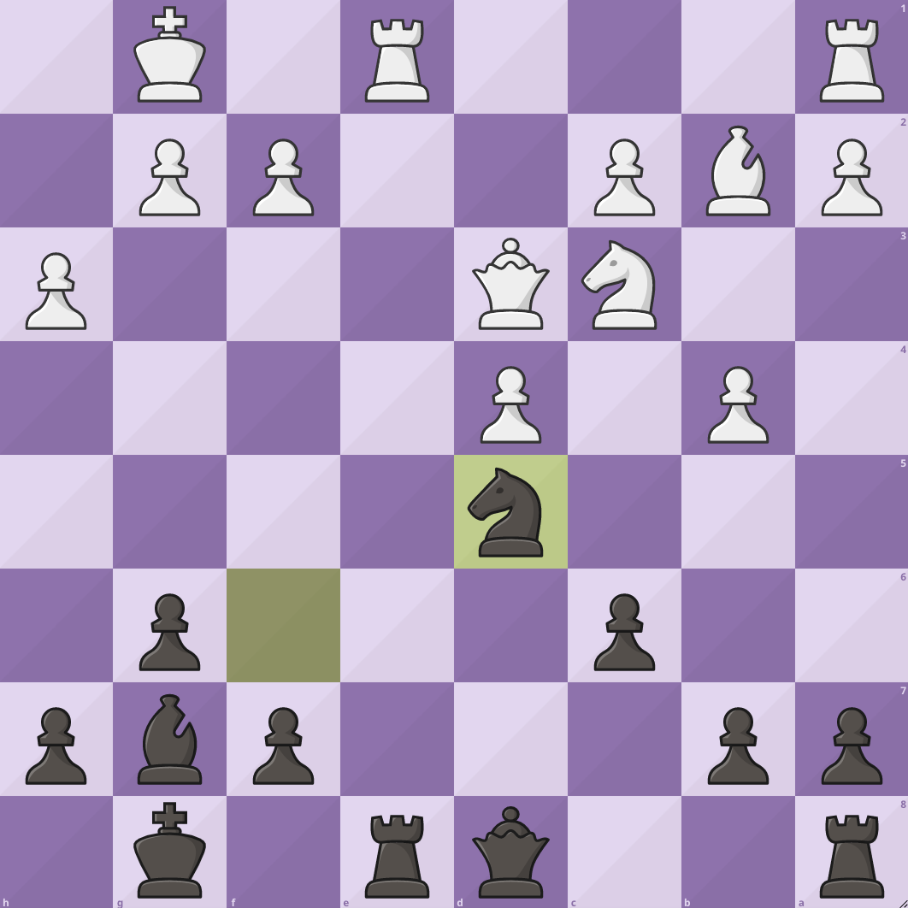
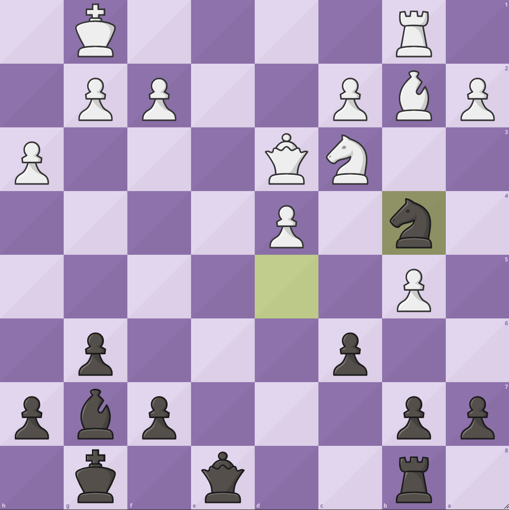
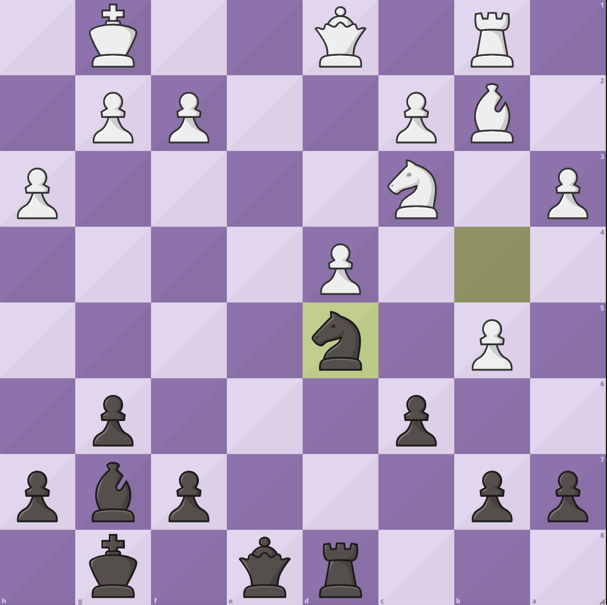
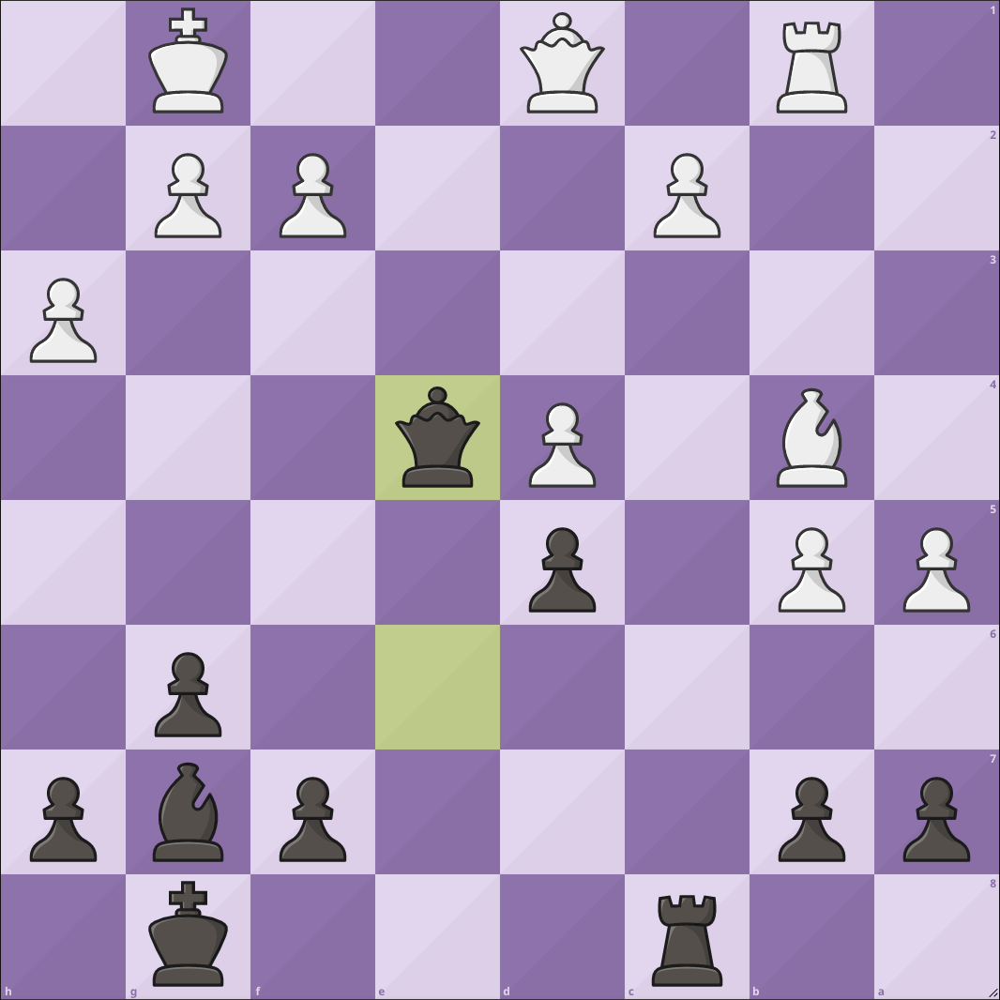
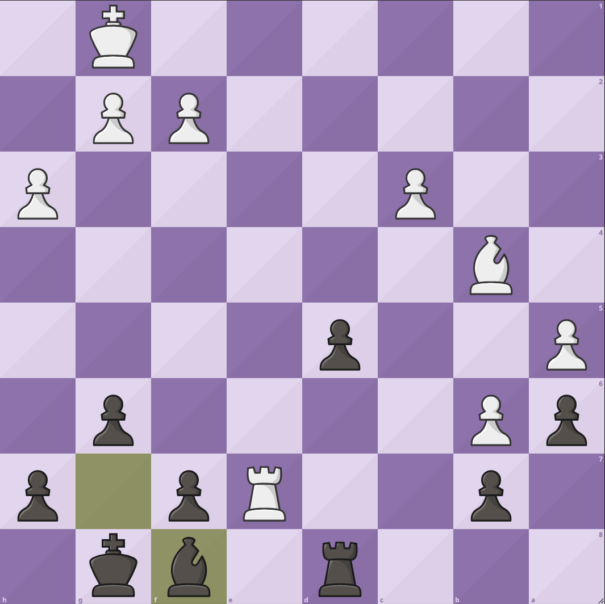
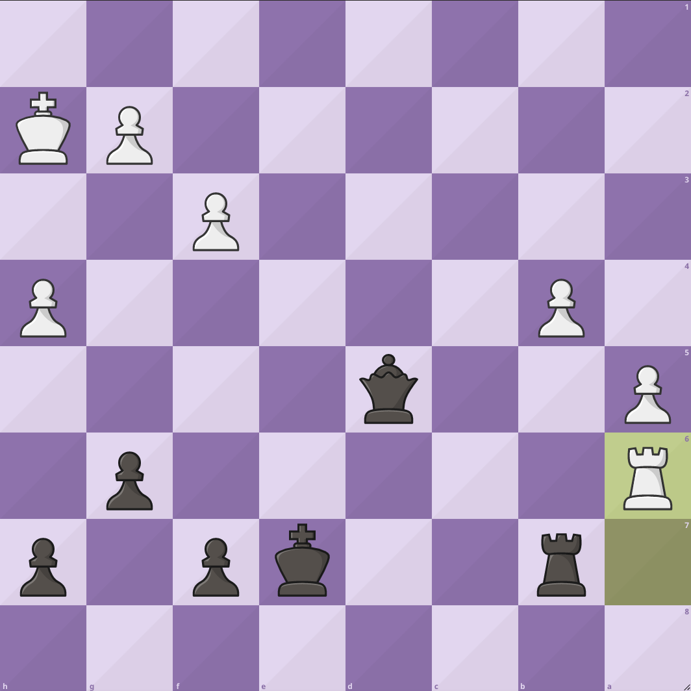

先週の日曜日に池袋チェスクラブの例会に行ってきました。池袋チェスクラブは今年の2月に行ってから2回目の参加となります。
時間は特に計らずでしたが、棋譜書くのを練習したかったので棋譜を書きながらの対局となり、2局指しました。
結果は2勝でしたが、投了で決着がつき、チェックメイトまで行けなかったのが心残りです。

## 1局目

今回は2局目を振り返ります。
私は黒番です。

1.d4,Nf6

Indian Gameのような始まり方をしました。

2.e3,g6 3.Bd3,Bg7 4.Nf3,O-O 5.O-O,d5 6.Nc3,Nc6 7.Re1,Bg4 8.h3,Bxf3 9.Qxf3,e5 10.dxe5, Nxe5 11.Qd1

このあたりは特に悪い手もなく順調に進んだように思います。

11...Nxd3

この手は悩みどころで、キングサイドのフィアンケットの形だとf7がよく狙われるため、相手の白マスビショップを取り除いた手でした。

12.Qxd3,c6 13.b4,Re8 14.Bb2,d4 15.exd4 Nd5

この手はd4のポーンを進めたくなかったのでナイトを配置したのですが、1ポーンダウンしている状態で自分から交換するような手になってしまっており、あまりナイトを活かせていないため良くない手だったかもしれません。

16.Rxe8+,Qxe8 17.b5,Rb8 18.Rb1,Nb4

ナイトをクイーンにあて一瞬気持ちの良い手ですが、ナイトの効きを狭め、次に動くマスの構想が弱かったので良い手ではなかったと思います。

19.Qd1,Rd8 20.a3,Nd5

ミスを認め、結局ナイトは元の位置に戻ってしまいました。

21.Nxd5 cxd5 22.a4,Qe7 23.Bc3,Rc8 24.Bb4,Qe6 25.a5,Qe4

24手目、クイーンをe5に移動する手が見えず、2手使ってしまうことになってしまいました。

26.Rc1,Qxd4 27.Qxd4,Bxd4 28.c3,Be5 29.b6,a6 30.Rd1,Rd8 31.Re1,Bg7 32.Re7,Bf8

ここは大悪手です。ビショップとルークの効きがキングの近くにあったため、焦ってBf8としたわけなのですが、焦らずとも良かったかもしれません。

33.Rxb7,Bxb4 34.cxb4,d4 35.Ra7,d3 36.b7,d2 37.Ra8,d1=Q+ 38.Kh2,Qd6+ 39.Kg1,Qd5 40.Ra7,Kf8 41.f3,Ke7 42.Kh2,Rb8 43.h4,Rxb7 44.Rxa6 0-1

最後は投了となり、勝利しました。
何はともあれ、OTBで勝てたのが初めてだったので良い経験になりました。

